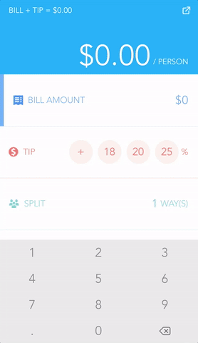

# Splitsies
Tip calculator made in Swift

App will automatically detect region and choose currency accordinlgy.

Features:
- Custom keypad
- Choose from a tip preset or enter a custom tip
- Split bill amongst a number of people
- Click the top right icon to generate a text message with total per person

