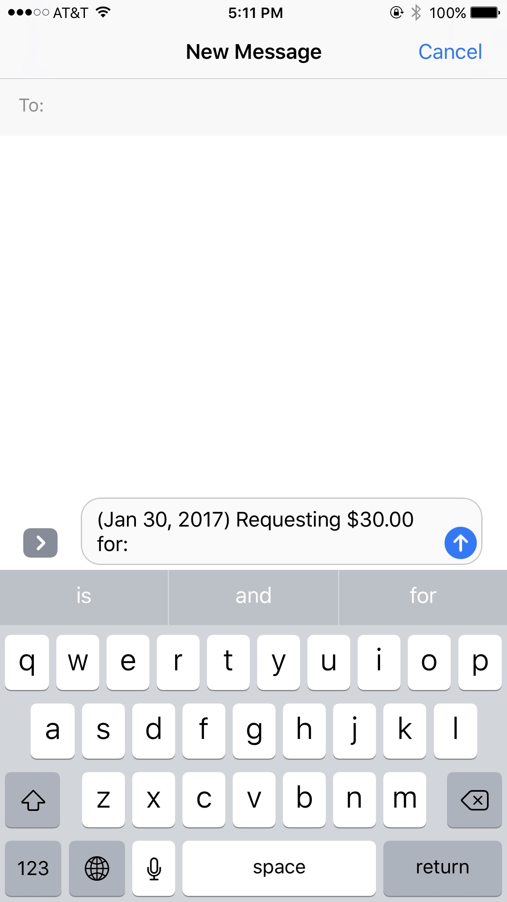

# Pre-work - Splitsies

Splitsies is a tip calculator application for iOS.

Submitted by: Josh Jeong

Time spent: 15 hours spent in total

## User Stories

* Custom keypad
* Choose from a tip preset or enter a custom tip
* Split bill amongst a number of people

The following **optional** features are implemented:
* [x] UI animations
* [x] Using locale-specific currency and currency thousands separators.
* [x] Making sure the keyboard is always visible and the bill amount is always the first responder. This way the user doesn't have to tap anywhere to use this app. Just launch the app and start typing.

The following **additional** features are implemented:

* Click the top right icon to generate a text message with total per person

## Video Walkthrough 

Here's a walkthrough of implemented user stories:

## Notes

Describe any challenges encountered while building the app.
* Adding constraints was tricky. Learned about stack views which made things a lot more manageable.
* First time dealing with animations. Was struggling with a view that kept resetting my animations. Later learned that auto layout was the culprit and that the animation for that use case should be done on the constraint instead.

## License

    Copyright [yyyy] [name of copyright owner]

    Licensed under the Apache License, Version 2.0 (the "License");
    you may not use this file except in compliance with the License.
    You may obtain a copy of the License at

        http://www.apache.org/licenses/LICENSE-2.0

    Unless required by applicable law or agreed to in writing, software
    distributed under the License is distributed on an "AS IS" BASIS,
    WITHOUT WARRANTIES OR CONDITIONS OF ANY KIND, either express or implied.
    See the License for the specific language governing permissions and
    limitations under the License.
