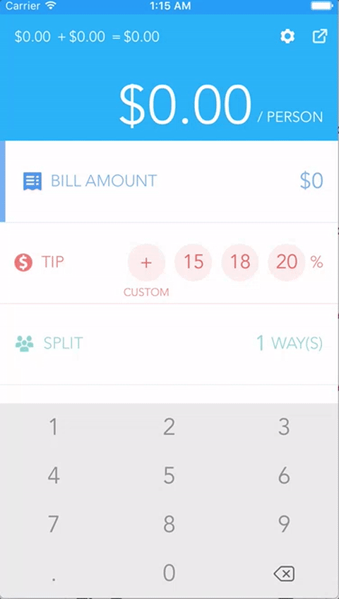

# Splitsies
Tip calculator made in Swift

App will automatically detect region and choose currency accordinlgy.

Features:
- Enter custom tip
- Split bill amongst a number of people
- Send a text message with total per person

